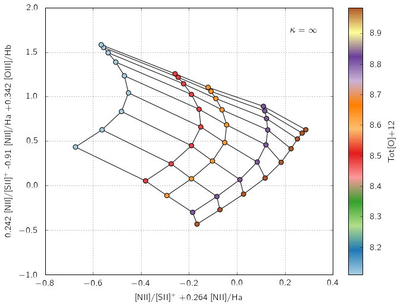

.. _runningpyqzadvanced:

Running pyqz II
=======================

This page is also available as an IPython notebook
(``pyqz_demo_advanced.ipynb``) included with the code and located in
``pyqz/examples/``.

First things first, let's start by importing pyqz and pyqz\_plots.

.. code:: python

    %matplotlib inline
    import pyqz
    import pyqz_plots

D) Using custom MAPPINGS grids
~~~~~~~~~~~~~~~~~~~~~~~~~~~~~~~~~~~~~~~~~~~

While pyqz ships with a default set of HII region simulations from
MAPPINGS, some (all!) users might be interested in using pyqz with their
own specific sets of MAPPINGS simulations. pyqz was designed to be
compatible with the grids generated from the awk script provided
alongside MAPPINGS.

If one uses the awk script to create new MAPPINGS grids, the resulting
``.csv`` file must be placed inside ``pyqz/reference_data/``. The
filename must match what the function
``pyqz.pyqz_tools.get_MVphotogrid_fn()`` expects for your given set of
parameters, e.g. should you have run a MAPPINGS model for
:math:`\log`\ (P/k)=6.7, plane-parralel HII regions and
:math:`\kappa=10`, the resulting grid name for the ``.csv`` file must
be:

.. code:: python

    pyqz.pyqz_tools.get_MVphotogrid_fn(Pk=6.7, calibs='GCZO', kappa =10, struct='pp')

.. parsed-literal::

    '/Users/fvogt/Tools/Python/fpav_pylib/pyqz/master_dev/src/../reference_data/grid_QZ_pp_GCZO_Pk67_k10.csv'

If one does not use the awk script to generate the custom MAPPINGS grid,
then just make sure your model grid matches the format of existing model
grids located in ``pyqz/reference_data/`` ...

E) Resampling the original MAPPINGS grids
~~~~~~~~~~~~~~~~~~~~~~~~~~~~~~~~~~~~~~~~~~~~~~~~~~~~~~~~

By default, 2 times resampled MAPPINGS grids are shipped with pyqz.
These are generated using the function
``pyqz.pyqz_tools.resample_MVphotogrid()``, which is straightforward to
use:

.. code:: python

    grid_fn = pyqz.pyqz_tools.get_MVphotogrid_fn(Pk=5.0,struct='sph', kappa='inf')
    pyqz.pyqz_tools.resample_MVphotogrid(grid_fn, sampling=2)

.. parsed-literal::

     
      Success: grid_QZ_sph_GCZO_Pk50_kinf.csv resampled by a factor 2x2 and saved as grid_QZ_sph_GCZO_Pk50_kinf_samp_2.csv

More densely resampled grids can then easily be created by varying the
``sampling`` keyword.

F) Projected 3-D line ratio diagrams
~~~~~~~~~~~~~~~~~~~~~~~~~~~~~~~~~~~~~~~~~~~~~~~~~~~

pyqz does support 2-D line ratio diagrams constructed from 3 sets of
line ratios (i.e. 3-D line ratio diagrams projected to a given 2-D
plane). For example, the diagnostic introduced in Dopita+ (2016) is:

.. code:: python

    pyqz_plots.plot_grid('[NII]/[SII]+;[NII]/Ha;[OIII]/Hb',
                         coeffs = [[1.0,0.264,0.0],[0.242,-0.910,0.342]],
                         struct='sph',
                         sampling=1)

