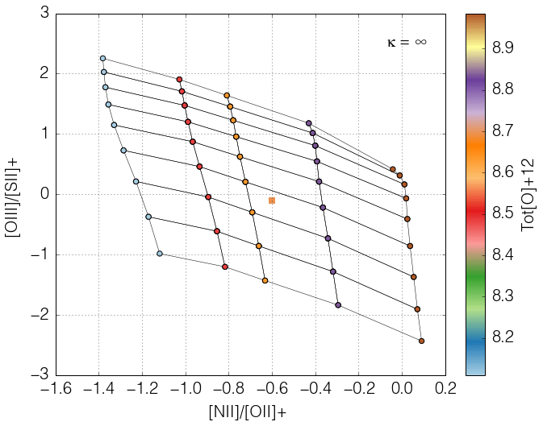
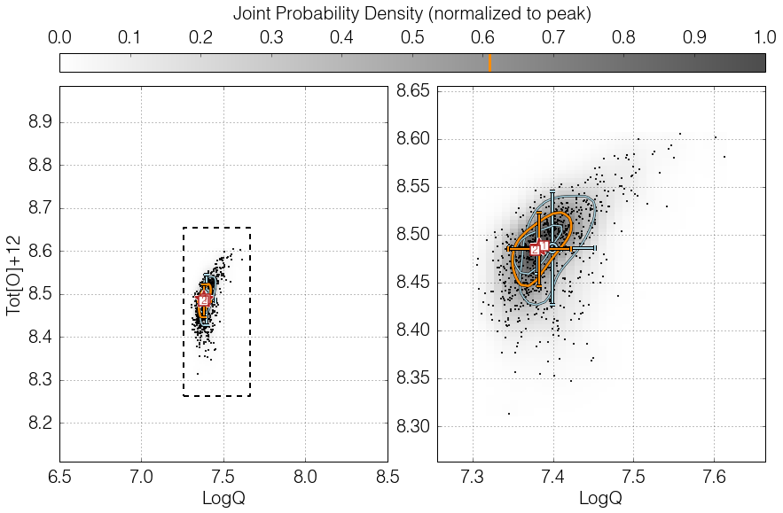

.. _runningpyqzbasic:

Running pyqz (basic)
=========================

This page is also available as an IPython notebook
(``pyqz_demo_basic.ipynb``) included with the code and located in
``pyqz/examples/``.

.. note:: 
   The code syntax in v0.7.0 has changed significantly, and so did the function calls. 
   pyqz v0.7.x is therefore NOT backward compatible with older pyqz versions.

.. warning:: 
   The examples below will show you how to run the main functions inside pyqz. 
   But these do not exempt you from getting acquainted with the :ref:`understandingpyqz` 
   section of the documentation !

Installing and importing pyqz
~~~~~~~~~~~~~~~~~~~~~~~~~~~~~~~~~

Installing pyqz is easy. Download it from Github, unpack it anywhere you like, and 
make sure that this location is in your Python path. You should then be able to import the 
package and check its version from within any Python shell:
::
    >>> import pyqz   
  
    Multiprocessing possible with: 8 cpus max. 
    Loaded matplotlib with backend: agg
    Loaded pyqz 0.7.2

.. warning:: 
   At this point in time, pyqz requires to use matplotlib with a non-interactive backend, 
   which will be forced to ``agg`` upon importing the module. This means no interactive 
   plot windows will pop up anymore, until you change the backend again. The safest way to 
   do so is restarting the Python shell. This requirements stems from the fact that 
   matplotlib does not fare well with the multiprocessing module on a Mac.

   We like enforcing non-interactive backends as little as you do. But that's the safest 
   way forward until we can identify an alternative.

Basic use 1: accessing MAPPINGS line ratio diagnostic grids
~~~~~~~~~~~~~~~~~~~~~~~~~~~~~~~~~~~~~~~~~~~~~~~~~~~~~~~~~~~

pyqz gives you easy access to the latest MAPPINGS strong nebular line
ratio diagnostic diagrams (and associated info on the MAPPINGS version
used to generate the grid, etc...). This can for example be useful to
create your own line ratio diagnostic plots. You can access the nodes of
any line ratio diagram using ``pyqz.get_grid()``:
::
   >>> a_grid = pyqz.get_grid('[NII]/[SII]+;[OIII]/[SII]+', sampling=1)

The main parameters of the MAPPINGS simulations can be specified via the
following keywords: 
- ``Pk`` let's you define the pressure of the simulated
HII regions, 
- ``struct`` allows you to choose between plane-parallel (``'pp'``)
and spherical (``'sph'``) HII regions, and 
- ``kappa`` lets you define the value of :math:`\kappa` (from the so-called :math:`\kappa`-distribution).

All these values must match an existing set of MAPPINGS simulations
inside the ``pyqz/reference_data/`` folder, or pyqz will issue an error. **In other words, 
pyqz will not be running new MAPPINGS simulations for you.**

So, if one wanted to access the MAPPINGS simulations for plane-parallel
HII regions, with Maxwell-Boltzmann electron density distribution, ``Pk =5.0`` 
(these are the default parameters), one should type:
::
   >>> a_grid = pyqz.get_grid('[NII]/[SII]+;[OIII]/[SII]+', struct = 'pp', Pk = 5, kappa = 'inf')

If you want to simply check how a given line ratio diagnostic diagram
looks (and e.g. check whether the MAPPINGS grid is flat, or wrapped) for
line ratios of your choice, you can use ``pyqz.check_grid()``:
::
   >>> bad_segments = pyqz.check_grid('[NII]/[OII]+;[OIII]/[OII]+', show_plot=True, 
   >>>                                 save_plot='./example_plots/check_grid.png')

Note how ``show_plot=True/False`` has no effect whatsoever - a consequence
of the ``agg`` backend enforced earlier. For this notebook to look decent, we must then include the saved file manually (sigh !) ...
::
   >>> from IPython.display import Image
   >>> Image(filename='./example_plots/check_grid.png')

.. image:: output_14_0.png
    :align: center

An important feature of pyqz is the auto-detection of wraps in the
diagnostic grids, marked with red segments in the diagram, and returned
as an array by the function ``pyqz.check_grid()``.

By default, the default MAPPINGS grids shipped with pyqz are coarse. For various reasons 
better explained elsewhere (see the MAPPINGS documentation), only a few abundance values 
have matching stellar tracks AND stellar atmospheres. Hence, only a few abundance points 
can be simulated in a consistent fashion.

Rather than 1) interpolating between stellar tracks and stellar
atmospheres in the abundance space and 2) running extra MAPPINGS models
(which would use inconsistent & interpolated input), pyqz can directly
resample each diagnostic grid (using the function
``pyqz_tools.refine_MVphotogrid()``, see the docs for more info). The resampling is 
performed in the {``LogQ`` and ``Tot[O+12]`` vs line ratio} space for all line ratios 
returned by MAPPINGS using Akima splines. Resampled grids can be accessed via the sampling 
keyword. Diagnostic grids resampled 2x2 times are shipped in the default pyqz package and 
are directly accessible, e.g.:
::
   >>> bad_segments = pyqz.check_grid('[NII]/[OII]+;[OIII]/[SII]+',show_plot=False, 
   >>>            save_plot='./example_plots/check_grid_resampled.png',
   >>>            sampling=2)

   >>> Image(filename='./example_plots/check_grid_resampled.png')

.. image:: output_16_0.png
    :align: center

In the default pyqz diagrams, the original MAPPINGS nodes are circled
with a black outline, while the reconstructed nodes are not. For grids
more densely resampled, see :ref:`runningpyqzadvanced`.

Basic use 2: deriving ``LogQ`` and ``Tot[O+12]`` for a given set of line ratios
~~~~~~~~~~~~~~~~~~~~~~~~~~~~~~~~~~~~~~~~~~~~~~~~~~~~~~~~~~~~~~~~~~~~~~~~~~~~~~~

At the core of pyqz lies ``pyqz.interp_qz()``, which is the basic routine
used to interpolate a given line ratio diagnostic grid. The function is
being fed by line ratios stored inside numpy arrays, and will only
return a value for line ratios landing on valid and un-wrapped regions
of the grid:
::
   >>> z = pyqz.interp_qz('Tot[O]+12',[np.array([-0.6]),np.array([-0.1])],
   >>>                '[NII]/[OII]+;[OIII]/[SII]+', 
   >>>                sampling=1,struct='pp', show_plot=False, 
   >>>                save_plot='./example_plots/interp_qz.png')
   >>> print z
   >>> Image(filename='./example_plots/interp_qz.png')

   [ 8.69743225]

Of course, one usually wants to compute both ``LogQ`` and ``Tot[O+12]`` or
``gas[O+12]`` for a large set of strong emission line fluxes, combining the
estimates from different line ratio diagnostics diagrams. This is
exactly what the function ``pyqz.get_global_qz()`` allows you to do.

The function is being fed the individual line fluxes and associated
errors in the form of numpy arrays and lists. ID tags for each dataset
can also be given to the function (these are then used if/when saving
the different diagrams to files).
::
   >>> fluxes_errs = np.array([[ 1.00000000e+00, 5.00000000e-02,
   >>>                           2.37684029e+00, 1.18842014e-01,
   >>>                           5.06523968e+00, 2.53261984e-01, 
   >>>                           5.67283302e-01, 2.83641651e-02,   
   >>>                           5.10740150e-01, 2.55370075e-02, 
   >>>                           2.87541146e+00, 1.43770573e-01]])
   >>> pyqz.get_global_qz(fluxes_errs,
   >>>                    ['Hb','stdHb','[OIII]','std[OIII]','[OII]+','std[OII]+',
   >>>                     '[NII]','std[NII]','[SII]+','std[SII]+','Ha','stdHa'],
   >>>                    ['[NII]/[SII]+;[OIII]/Hb','[NII]/[OII]+;[OIII]/[SII]+'], 
   >>>                    ids = ['NGC_1234'],
   >>>                    save_plot='KDE_all', # set this to 'grids', 'KDE_all', False or 'KDE_flags'
   >>>                    plot_loc = './example_plots', 
   >>>                    KDE_method = 'multiv',
   >>>                    KDE_qz_sampling=201j,
   >>>                    struct='pp',
   >>>                    sampling=1)
   >>> Image(filename='./example_plots/NGC_1234_LogQ_Tot[O]+12_multiv_srs400_Pk50_kinf_pp.png')
     
   --> Received 1 spectrum ...
   --> Dealing with them one at a time ... be patient now !
     
   All done in 0:00:01.799493

By default, all line fluxes errors are assumed to be gaussian, where the
input std value is the 1 standard deviation. Alternatively, line fluxes
can be tagged as upper-limits by setting their errors to -1.

Users less keen on using Python extensively can alternatively feed their
data to pyqz via an appropriately structured ``.csv`` file and receive
another ``.csv`` file in return:
::
   >>> pyqz.get_global_qz_ff('./example_input.csv', 
   >>>                       ['[NII]/[SII]+;[OIII]/Hb','[NII]/[OII]+;[OIII]/[SII]+'], 
   >>>                       show_plot=False, # always set this to fault - will ensure maximum speed, even if nothing is displayed !
   >>>                       save_plot='KDE_all',  # set this to 'grids', 'KDE_all', False or 'KDE_flags' (i.e. only the problematic points) 
   >>>                       plot_loc = './example_plots/', 
   >>>                       struct='pp',
   >>>                       KDE_method='multiv',
   >>>                       KDE_qz_sampling = 201j,
   >>>                       sampling=1)
   >>> Image(filename='./example_plots/NGC_1234ff_LogQ_Tot[O]+12_multiv_srs400_Pk50_kinf_pp.png')
     
   --> Received 1 spectrum ...
   --> Dealing with them one at a time ... be patient now !
     
   All done in 0:00:01.986989

.. image:: output_25_1.png
   :align: center

The first line of the input file must contain the name of each column,
following the pyqz convention. The order itself does not matter, e.g.:
::
   Id,[OII]+,std[OII]+,Hb,stdHb,[OIII],std[OIII],[OI],std[OI],Ha,stdHa,[NII],std[NII],[SII]+,std[SII]+

The Id (optional) can be used to add a tag (i.e. a string) to each set
of line fluxes. This tag will be used in the filenames of the diagrams
(if some are saved) and in the output ``.csv`` file as well.

Commented line begin with ``#``, missing values are marked with
``$$$`` (set with the ``missing_values`` keyword), and the decimal
precision in the output file is set with ``decimals`` (default=5).

At this point, it must be stressed that ``pyqz.get_global_qz()`` can only
exploit a finite set of diagnostic grids, namely:
::
   >>> pyqz.diagnostics.keys()

   ['[NII]/[OII]+;[OIII]/[SII]+',
    '[NII]/[OII]+;[OIII]/[OII]+',
    '[NII]/[SII]+;[NII]/Ha;[OIII]/Hb',
    '[NII]/[SII]+;[OIII]/Hb',
    '[OIII]4363/[OIII];[OIII]/[SII]+',
    '[NII]/[SII]+;[OIII]/[OII]+',
    '[NII]/[OII]+;[SII]+/Ha',
    '[OIII]4363/[OIII];[SII]+/Ha',
    '[OIII]4363/[OIII];[OIII]/[OII]+',
    '[NII]/[SII]+;[OIII]/[SII]+']

These specific diagnostic diagrams are chosen to be largely flat, i.e.
they are able to cleanly disentangle the influence of ``LogQ`` and
``Tot[O]+12``. One does not need to use all the grids together. For example,
if one knows that an ``[OII]`` line flux measurement is corrupted, one ought
to simply use the diagnostic grids that do not rely on this line to
derive the estimates of ``LogQ`` and ``Tot[O]+12``.

Users can easily add new diagnostics to this list (defined inside
``pyqz_metadata.py``), but will do so at their own risk.
