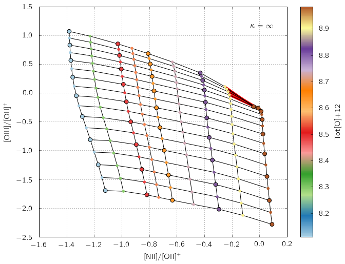
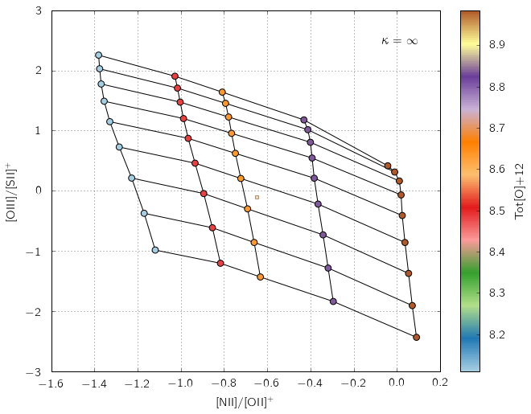
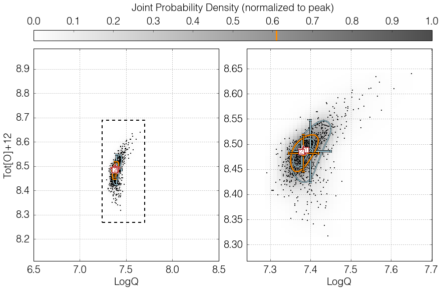
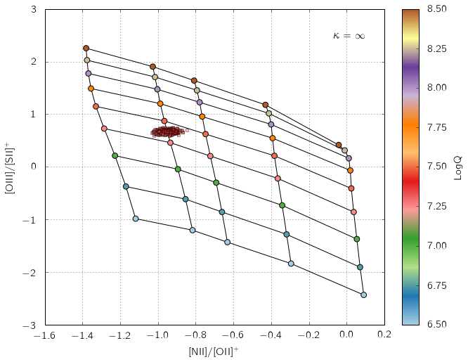

.. _runningpyqzbasic:

Running pyqz I
====================

This page is also available as an IPython notebook
(``pyqz_demo_basic.ipynb``) included with the code and located in
``pyqz/examples/``.

.. Note: 
    The code syntax in v0.8.0 has changed significantly, and so did the function calls. 
    pyqz v0.8.x is therefore NOT backward compatible with older pyqz versions.

.. Warning: 
    The examples below will show you how to run the main functions inside pyqz. But these 
    do not exempt you from getting acquainted with the "Understanding pyqz" section of the 
    documentation !

A) Installing and importing pyqz
~~~~~~~~~~~~~~~~~~~~~~~~~~~~~~~~~~

Installing pyqz is easy. Download it from Github, unpack it anywhere you
like, and make sure that this location is in your Python path. You
should then be able to import the package and check its version from
within any Python shell:

.. code:: python

    %matplotlib inline
    import pyqz
    
    import numpy as np

From v0.8.0 onwards, the plotting functions have been separated in a
distinct module, which must be import separately, if you wish to exploit
them.

.. code:: python

    import pyqz_plots

B) Accessing MAPPINGS line ratio diagnostic grids
~~~~~~~~~~~~~~~~~~~~~~~~~~~~~~~~~~~~~~~~~~~~~~~~~~~~~~~~~~~

pyqz gives you easy access to the latest MAPPINGS strong nebular line
ratio diagnostic diagrams (and associated info on the MAPPINGS version
used to generate the grid, etc...). This can for example be useful to
create your own line ratio diagnostic plots. You can access the nodes of
any line ratio diagram using ``pyqz.get_grid()``:

.. code:: python

    a_grid = pyqz.get_grid('[NII]/[SII]+;[OIII]/[SII]+', sampling=1)

The main parameters of the MAPPINGS simulations can be specified via the
following keywords: 
   - ``Pk`` let's you define the pressure of the simulated HII regions, 
   - ``struct`` allows you to choose between plane-parallel (``'pp'``) and spherical (``'sph'``) HII regions, and 
   - ``kappa`` lets you define the value of :math:`\kappa` (from the so-called :math:`\kappa`-distribution).

All these values must match an existing set of MAPPINGS simulations
inside the ``pyqz/reference_data/`` folder, or pyqz will issue an error.
In other words, pyqz will not be running new MAPPINGS simulations for
you.

So, if one wanted to access the MAPPINGS simulations for plane-parallel
HII regions, with Maxwell-Boltzmann electron density distribution,
``Pk = 5.0`` (these are the default parameters), one should type:

.. code:: python

    a_grid = pyqz.get_grid('[NII]/[SII]+;[OIII]/[SII]+', struct = 'pp', Pk = 5, kappa = 'inf')

If you want to check how a given line ratio diagnostic diagram looks
(and e.g. check whether the MAPPINGS grid is flat, or wrapped) for line
ratios of your choice, you can use ``pyqz_plots.plot_grid()``:

.. code:: python

    pyqz_plots.plot_grid('[NII]/[OII]+;[OIII]/[OII]+', struct = 'pp', Pk = 5, kappa = 'inf')

.. image:: output_13_0.png

You can check which version of MAPPINGS was used to generate the grids
currently inside pyqz as follows:

.. code:: python

    fn = pyqz.pyqz_tools.get_MVphotogrid_fn(Pk = 5.0, calibs = 'GCZO', kappa = np.inf, struct = 'pp', sampling = 1)
    info = pyqz.pyqz_tools.get_MVphotogrid_metadata(fn)
    
    print 'MAPPINGS id: %s' % info['MV_id']
    print 'Model created: %s' % info['date']
    print 'Model parameters: %s' % info['params'].split(': ')[1]

.. parsed-literal::

    MAPPINGS id: MAPPINGS V HII Region Grid: QZ pp_GCZO_Pk50_kinf
    Model created: Thu Dec 10 14:16:36 CLST 2015
    Model parameters: pp,two,LPk=5.0,dep=Depln_Fe_1.50.txt,kap=inf,GCZFea05t2,SF=cont,a05,isp,#11,P6,Mv5.0.16,Svm802,FE15

An important feature of pyqz is the auto-detection of wraps in the
diagnostic grids, marked with red segments in the diagram, and returned
as an array by the function ``pyqz.check_grid()``.

The default MAPPINGS grids shipped with pyqz are coarse. For various
reasons better explained elsewhere (see the MAPPINGS documentation),
only a few abundance values have matching stellar tracks AND stellar
atmospheres. Hence, only a few abundance points can be simulated in a
consistent fashion.

Rather than 1) interpolating between stellar tracks and stellar
atmospheres in the abundance space and 2) running extra MAPPINGS models
(which would use inconsistent & interpolated input), pyqz can directly
resample each diagnostic grid (using the function
``pyqz_tools.refine_MVphotogrid()``, see the docs for more info). The
resampling is performed in the {``LogQ`` and ``Tot[O+12]`` vs line
ratio} space for all line ratios returned by MAPPINGS using Akima
splines. Resampled grids can be accessed via the ``sampling`` keyword.
Diagnostic grids resampled 2x2 times are shipped in the default pyqz
package and are directly accessible, e.g.:

.. code:: python

    pyqz_plots.plot_grid('[NII]/[OII]+;[OIII]/[OII]+', struct = 'pp', Pk = 5, kappa = 'inf', sampling=2)

In the default pyqz diagrams, the original MAPPINGS nodes are circled
with a black outline, while the reconstructed nodes are not. For grids
more densely resampled, see the "Advanced use 2" below.

C) Deriving LogQ and Tot[O+12] for a given set of line ratios
~~~~~~~~~~~~~~~~~~~~~~~~~~~~~~~~~~~~~~~~~~~~~~~~~~~~~~~~~~~~~~~~~~~~~~~

At the core of pyqz lies ``pyqz.interp_qz()``, which is the basic
routine used to interpolate a given line ratio diagnostic grid. The
function is being fed by line ratios stored inside numpy arrays, and
will only return a value for line ratios landing on valid and un-wrapped
regions of the grid:

.. code:: python

    niioii = np.array([-0.65])
    oiiisii = np.array([-0.1])
    z = pyqz.interp_qz('Tot[O]+12',[niioii, oiiisii],'[NII]/[OII]+;[OIII]/[SII]+', 
                       sampling=1,struct='pp')
    print 'Tot[O]+12 = %.2f' % z
    
    # The result can be visualized using pyqz_plots.plot_grid()
    pyqz_plots.plot_grid('[NII]/[OII]+;[OIII]/[SII]+',sampling = 1, struct='pp', data = [niioii,oiiisii], interp_data=z)

.. parsed-literal::

    Tot[O]+12 = 8.67

Of course, one usually wants to compute both ``LogQ`` and
``Tot[O+12]``\ or ``gas[O+12]`` for a large set of strong emission line
fluxes, combining the estimates from different line ratio diagnostics
diagrams. This is exactly what the function ``pyqz.get_global_qz()``
allows you to do.

The function is being fed the individual line fluxes and associated
errors in the form of numpy arrays and lists. ID tags for each dataset
can also be given to the function (these are then used if/when saving
the different diagrams to files).

.. code:: python

    pyqz.get_global_qz(np.array([[ 1.00e+00, 5.00e-02, 2.38e+00, 1.19e-01, 5.07e+00, 2.53e-01, 
                                   5.67e-01, 2.84e-02, 5.11e-01, 2.55e-02, 2.88e+00, 1.44e-01]]),
                       ['Hb','stdHb','[OIII]','std[OIII]','[OII]+','std[OII]+',
                        '[NII]','std[NII]','[SII]+','std[SII]+','Ha','stdHa'],
                       ['[NII]/[SII]+;[OIII]/Hb','[NII]/[OII]+;[OIII]/[SII]+'], 
                       ids = ['NGC_1234'],
                       KDE_method = 'multiv',
                       KDE_qz_sampling = 201j,
                       struct = 'pp',
                       sampling = 1,
                       verbose = True)

.. parsed-literal::

     
    --> Received 1 spectrum ...
    --> Dealing with them one at a time ... be patient now !
        (no status update until I am done ...)
     
    All done in 0:00:00.570925

.. parsed-literal::

    [array([[  7.38831887e+00,   8.48760006e+00,   7.37681443e+00,
               8.48372388e+00,   7.38256665e+00,   5.75221877e-03,
               8.48566197e+00,   1.93808636e-03,   7.40187112e+00,
               5.25153395e-02,   8.48403665e+00,   5.81923212e-02,
               7.38004469e+00,   2.91962544e-02,   8.48364792e+00,
               2.74853806e-02,   7.38278851e+00,   3.35428824e-02,
               8.48207392e+00,   3.32925610e-02,   0.00000000e+00,
               0.00000000e+00]]),
     ['[NII]/[SII]+;[OIII]/Hb|LogQ',
      '[NII]/[SII]+;[OIII]/Hb|Tot[O]+12',
      '[NII]/[OII]+;[OIII]/[SII]+|LogQ',
      '[NII]/[OII]+;[OIII]/[SII]+|Tot[O]+12',
      '<LogQ>',
      'std(LogQ)',
      '<Tot[O]+12>',
      'std(Tot[O]+12)',
      '[NII]/[SII]+;[OIII]/Hb|LogQ{KDE}',
      'err([NII]/[SII]+;[OIII]/Hb|LogQ{KDE})',
      '[NII]/[SII]+;[OIII]/Hb|Tot[O]+12{KDE}',
      'err([NII]/[SII]+;[OIII]/Hb|Tot[O]+12{KDE})',
      '[NII]/[OII]+;[OIII]/[SII]+|LogQ{KDE}',
      'err([NII]/[OII]+;[OIII]/[SII]+|LogQ{KDE})',
      '[NII]/[OII]+;[OIII]/[SII]+|Tot[O]+12{KDE}',
      'err([NII]/[OII]+;[OIII]/[SII]+|Tot[O]+12{KDE})',
      '<LogQ{KDE}>',
      'err(LogQ{KDE})',
      '<Tot[O]+12{KDE}>',
      'err(Tot[O]+12{KDE})',
      'flag',
      'rs_offgrid']]

By default, all line fluxes errors are assumed to be gaussian, where the
input ``std`` value is the 1 standard deviation. Alternatively, line
fluxes can be tagged as upper-limits by setting their errors to -1.

The outcome of ``get_global_qz()`` can be visualized using
``pyqz_plots.plot_global_qz()``, but only if ``KDE_pickle_loc`` is set
in the first one. This keyword defines the location in which to save a
``pickle`` file that contains all the relevant pieces of information
associated with a given function call, i.e.: the single and global KDE,
the ``srs`` random realizations of the line fluxes, etc ...

.. code:: python

    out = pyqz.get_global_qz(np.array([[ 1.00e+00, 5.00e-02, 2.38e+00, 1.19e-01, 5.07e+00, 2.53e-01, 
                                         5.67e-01, 2.84e-02, 5.11e-01, 2.55e-02, 2.88e+00, 1.44e-01]]),
                       ['Hb','stdHb','[OIII]','std[OIII]','[OII]+','std[OII]+',
                        '[NII]','std[NII]','[SII]+','std[SII]+','Ha','stdHa'],
                       ['[NII]/[SII]+;[OIII]/Hb','[NII]/[OII]+;[OIII]/[SII]+'], 
                       ids = ['NGC_1234'],
                       KDE_method = 'multiv',
                       KDE_qz_sampling = 201j,
                       KDE_pickle_loc = './example_plots/',
                       struct = 'pp',
                       sampling = 1,
                       verbose = True)
    
    import glob
    fn = glob.glob('./example_plots/*NGC_1234*.pkl')
    
    # pyqz_plots.get_global_qz() takes the pickle filename as argument. 
    pyqz_plots.plot_global_qz(fn[0], show_plots=True, save_loc = './example_plots', do_all_diags=True)

.. parsed-literal::

     
    --> Received 1 spectrum ...
    --> Dealing with them one at a time ... be patient now !
        (no status update until I am done ...)
     
    All done in 0:00:00.639897

.. image:: output_25_3.png

.. image:: output_25_4.png

.. image:: output_25_5.png

Users less keen on using Python extensively can alternatively feed their
data to pyqz via an appropriately structured ``.csv`` file and receive
another ``.csv`` file in return (as well as a numpy array):

.. code:: python

    pyqz.get_global_qz_ff('./example_input.csv', 
                          ['[NII]/[SII]+;[OIII]/Hb','[NII]/[OII]+;[OIII]/[SII]+'], 
                          struct='pp',
                          KDE_method='multiv',
                          KDE_qz_sampling = 201j,
                          sampling=1)

.. parsed-literal::

     
    --> Received 1 spectrum ...
    --> Dealing with them one at a time ... be patient now !
        (no status update until I am done ...)
     
    All done in 0:00:00.521950

.. parsed-literal::

    (array([[  7.38831887e+00,   8.48760006e+00,   7.37681443e+00,
               8.48372388e+00,   7.38256665e+00,   5.75221877e-03,
               8.48566197e+00,   1.93808636e-03,   7.40830999e+00,
               5.96592780e-02,   8.49102382e+00,   5.97711699e-02,
               7.38561173e+00,   2.66149396e-02,   8.48676873e+00,
               2.35291434e-02,   7.38608041e+00,   3.38911741e-02,
               8.48524692e+00,   3.24784930e-02,   0.00000000e+00,
               0.00000000e+00]]),
     ['[NII]/[SII]+;[OIII]/Hb|LogQ',
      '[NII]/[SII]+;[OIII]/Hb|Tot[O]+12',
      '[NII]/[OII]+;[OIII]/[SII]+|LogQ',
      '[NII]/[OII]+;[OIII]/[SII]+|Tot[O]+12',
      '<LogQ>',
      'std(LogQ)',
      '<Tot[O]+12>',
      'std(Tot[O]+12)',
      '[NII]/[SII]+;[OIII]/Hb|LogQ{KDE}',
      'err([NII]/[SII]+;[OIII]/Hb|LogQ{KDE})',
      '[NII]/[SII]+;[OIII]/Hb|Tot[O]+12{KDE}',
      'err([NII]/[SII]+;[OIII]/Hb|Tot[O]+12{KDE})',
      '[NII]/[OII]+;[OIII]/[SII]+|LogQ{KDE}',
      'err([NII]/[OII]+;[OIII]/[SII]+|LogQ{KDE})',
      '[NII]/[OII]+;[OIII]/[SII]+|Tot[O]+12{KDE}',
      'err([NII]/[OII]+;[OIII]/[SII]+|Tot[O]+12{KDE})',
      '<LogQ{KDE}>',
      'err(LogQ{KDE})',
      '<Tot[O]+12{KDE}>',
      'err(Tot[O]+12{KDE})',
      'flag',
      'rs_offgrid'])

The first line of the input file must contain the name of each column,
following the pyqz convention. The order itself does not matter, e.g.:

``Id,[OII]+,std[OII]+,Hb,stdHb,[OIII],std[OIII],[OI],std[OI],Ha,stdHa,[NII],std[NII],[SII]+,std[SII]+``

The ``Id`` (optional) can be used to add a tag (i.e. a string) to each
set of line fluxes. This tag will be used in the filenames of the
diagrams (if some are saved) and in the output ``.csv`` file as well.

Commented line begin with ``#``, missing values are marked with ``$$$``
(set with the ``missing_values`` keyword), and the decimal precision in
the output file is set with ``decimals`` (default=5).

**At this point, it must be stressed that ``pyqz.get_global_qz()`` can
only exploit a finite set of diagnostic grids, namely:**

.. code:: python

    pyqz.diagnostics.keys()

.. parsed-literal::

    ['[NII]/[OII]+;[OIII]/[SII]+',
     '[NII]/[OII]+;[OIII]/[OII]+',
     '[NII]/[SII]+;[NII]/Ha;[OIII]/Hb',
     '[NII]/[SII]+;[OIII]/Hb',
     '[OIII]4363/[OIII];[OIII]/[SII]+',
     '[NII]/[SII]+;[OIII]/[OII]+',
     '[NII]/[OII]+;[SII]+/Ha',
     '[OIII]4363/[OIII];[SII]+/Ha',
     '[OIII]4363/[OIII];[OIII]/[OII]+',
     '[NII]/[SII]+;[OIII]/[SII]+']

These specific diagnostic diagrams are chosen to be largely flat, i.e.
they are able to cleanly disentangle the influence of ``LogQ`` and
``Tot[O]+12``. One does not need to use all the grids together. For
example, if one knows that an [OII] line flux measurement is corrupted,
one ought to simply use the diagnostic grids that do not rely on this
line to derive the estimates of ``LogQ`` and ``Tot[O]+12``.

Users can easily add new diagnostics to this list (defined inside
``pyqz_metadata.py``), but will do so at their own risk.

