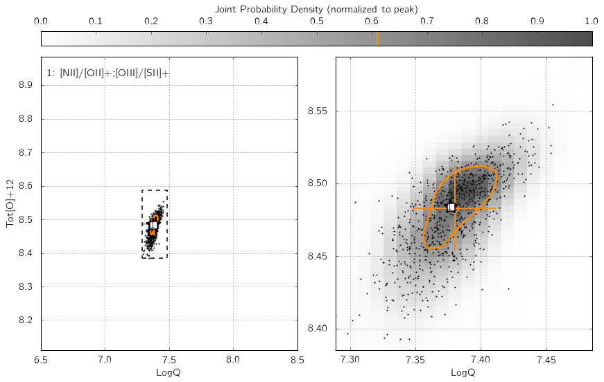
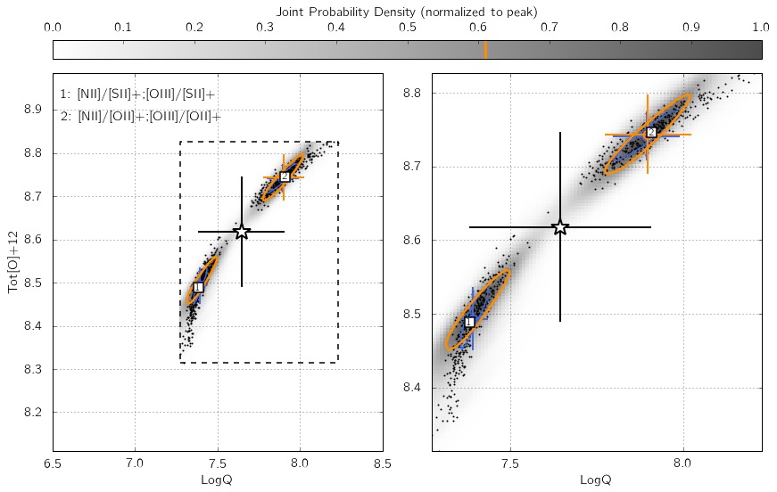
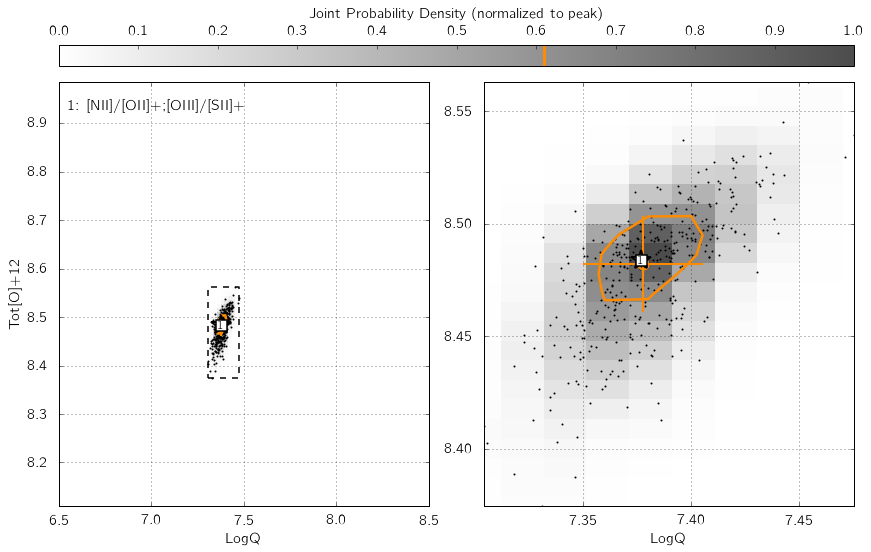

.. _pyqzparam:

The parameters of pyqz
==========================

This page is also available as an IPython notebook
(``pyqz_demo_param.ipynb``) included with the code and located in
``pyqz/examples/``.

pyqz is designed to be easy and quick to use, but without withholding any
information to the user. As such, all parameters of importance for
deriving the estimates of ``LogQ`` and ``Tot[O]+12`` can be modified via
dedicated keywords. Here, we present some basic examples to clarify what
does what. In addition to these examples, the documentation also contains 
a detailed list of :ref:`ref-funcs`, along
with a brief description of each keyword.

First things first, let's import pyqz and the Image module to display
the figures.
::
   >>> import pyqz
   >>> from IPython.display import Image

Parameter 1: ``srs``
~~~~~~~~~~~~~~~~~~~~

``srs`` defines the *size of the random sample* of line fluxes generated by
pyqz. This is an essential keyword to the propagation of observational
errors associated with each line flux measurements. In other words, ``srs``
is the number of discrete estimates of the probability density function
(in the {``LogQ`` vs. ``Tot[O]+12``} plane) associated with one diagnostic grid.

Hence, the joint probability function density function (combining
:math:`n` diagnostic grids) will be reconstructed via a Kernel Density
Estimation routine from :math:`n\cdot`\ srs points. ``srs=400`` is the
default value, suitable for error levels of ~5%. We
suggest ``srs=800`` for errors at the 10%-15% level. Basically, larger
errors result in wider probability density peaks, and thus require more
``srs`` points to be properly discretized - at the cost of additional
computation time of course ! Try changing the value of ``my_srs`` in the
example below, and watch the number of black dots vary accordingly in
the KDE diagram.
::
   >>> my_srs = 800
   >>> fluxes_errs = np.array([[ 1.00000000e+00, 5.00000000e-02,
   >>>                           2.37684029e+00, 1.18842014e-01,
   >>>                           5.06523968e+00, 2.53261984e-01, 
   >>>                           5.67283302e-01, 2.83641651e-02,   
   >>>                           5.10740150e-01, 2.55370075e-02, 
   >>>                           2.87541146e+00, 1.43770573e-01]])
   >>> pyqz.get_global_qz(fluxes_errs,
   >>>                 ['Hb','stdHb','[OIII]','std[OIII]','[OII]+','std[OII]+',
   >>>                  '[NII]','std[NII]','[SII]+','std[SII]+','Ha','stdHa'],
   >>>                 ['[NII]/[OII]+;[OIII]/[SII]+'], 
   >>>                 ids = ['NGC_1234'],
   >>>                 srs = my_srs,
   >>>                 show_plot=False, # set this to True to also see the individual line ratio diagrams
   >>>                 save_plot='KDE_all',  # set this to 'grids', 'KDE_all', False or 'KDE_flags' (i.e. only the problematic points) 
   >>>                 plot_loc = './example_plots/', 
   >>>                 KDE_method = 'multiv',
   >>>                 KDE_qz_sampling=201j,
   >>>                 struct='pp',
   >>>                 sampling=1)
   >>> Image(filename='./example_plots/NGC_1234_LogQ_Tot[O]+12_multiv_srs'+np.str(my_srs)+'_Pk50_kinf_pp.png')

   --> Received 1 spectrum ...
   --> Dealing with them one at a time ... be patient now !
     
   All done in 0:00:01.197884

Parameter 2: ``KDE_method``
~~~~~~~~~~~~~~~~~~~~~~~~~~~

This keyword specifies the Kernel Density Estimation routine used to
reconstruct the individual and joint probability density functions in
the {``LogQ`` vs. ``Tot[O]+12``} plane. It can be either ``gauss`` to use
``gaussian_kde`` from the ``scipy.stats`` module, or ``multiv`` to use
``KDEMultivariate`` from the statsmodels package.

The former option is 10-100 times faster, but usually results in less
accurate results if different diagnostic grids disagree. The underlying
reason is that with ``gaussian_kde``, the kernel bandwidth cannot be
explicitly set individually for the ``LogQ`` and ``Tot[O]+12`` directions, so
that the function tends to over-smooth the distribution. ``KDEMultivariate``
should be preferred as the bandwidth of the kernel is set individually
for both the ``LogQ`` and ``Tot[O]+12`` directions using Scott's rule, scaled by
the standard deviation of the distribution along these directions.

In the example below, we insert some error in the [OII] line flux -
thereby creating a mismatch between the different line ratio space
estimates. Switch my\_method from ``'gauss'`` to ``'multiv'``, and watch how the
joint PDF (shown as shades of grey) traces the distribution of black
dots in a significantly worse/better manner.
::

   >>> my_method = 'gauss'
   >>> fluxes_errs = np.array([[ 1.00000000e+00, 5.00000000e-02,
   >>>                           2.37684029e+00, 1.18842014e-01, 
   >>>                           3.06523968e+00, 2.53261984e-01, 
   >>>                           5.67283302e-01, 2.83641651e-02,   
   >>>                           5.10740150e-01, 2.55370075e-02, 
   >>>                           2.87541146e+00, 1.43770573e-01]])
   >>> pyqz.get_global_qz(fluxes_errs,
   >>>                    ['Hb','stdHb','[OIII]','std[OIII]','[OII]+','std[OII]+',
   >>>                     '[NII]','std[NII]','[SII]+','std[SII]+','Ha','stdHa'],
   >>>                    ['[NII]/[SII]+;[OIII]/[SII]+','[NII]/[OII]+;[OIII]/[OII]+'], 
   >>>                    ids = ['NGC_1234'],
   >>>                    srs = 400,
   >>>                    show_plot=False, # set this to True to also see the individual line ratio diagrams
   >>>                    save_plot='KDE_all',  # set this to 'grids', 'KDE_all', False or 'KDE_flags' (i.e. only the problematic points) 
   >>>                    plot_loc = './example_plots/', 
   >>>                    KDE_method = my_method,
   >>>                    KDE_qz_sampling=201j,
   >>>                    struct='pp',
   >>>                    sampling=1)
   >>> Image(filename='./example_plots/NGC_1234_LogQ_Tot[O]+12_'+my_method+'_srs400_Pk50_kinf_pp.png')

   --> Received 1 spectrum ...
   --> Dealing with them one at a time ... be patient now !
     
   All done in 0:00:01.392809

Parameter 3: ``KDE_qz_sampling``
~~~~~~~~~~~~~~~~~~~~~~~~~~~~~~~~~

This sets the sampling of the {``LogQ`` vs. ``Tot[O]+12``} plane, when
reconstructing the individual and global PDFs. Set to ``101j`` by default
(i.e. a grid with 101x101 = 10201 sampling nodes), datasets with small errors (<5%)
could benefit from using twice this resolution for better results (i.e.
``KDE_qz_sampling=201j``). Resulting in a longer processing time of
course. In the following example, the influence of ``KDE_qz_sampling`` can
be seen in the size of the resolution elements of the joint PDF map (in grey), as
well as the smoothness of the (orange) contour at 0.61%.
::

   >>> my_qz_sampling = 101j
   >>> fluxes_errs = p.array([[ 1.00000000e+00, 5.00000000e-02,
   >>>                          2.37684029e+00, 1.18842014e-01,
   >>>                          5.06523968e+00, 2.53261984e-01, 
   >>>                          5.67283302e-01, 2.83641651e-02,   
   >>>                          5.10740150e-01, 2.55370075e-02, 
   >>>                          2.87541146e+00, 1.43770573e-01]])
   >>> pyqz.get_global_qz(fluxes_errs,
   >>>                    ['Hb','stdHb','[OIII]','std[OIII]','[OII]+','std[OII]+',
   >>>                     '[NII]','std[NII]','[SII]+','std[SII]+','Ha','stdHa'],
   >>>                    ['[NII]/[OII]+;[OIII]/[SII]+'], 
   >>>                    ids = ['NGC_1234'],
   >>>                    srs = 400,
   >>>                    show_plot=False, # set this to True to also see the individual line ratio diagrams
   >>>                    save_plot='KDE_all',  # set this to 'grids', 'KDE_all', False or 'KDE_flags' (i.e. only the problematic points) 
   >>>                    plot_loc = './example_plots/', 
   >>>                    KDE_method = 'multiv',
   >>>                    KDE_qz_sampling=my_qz_sampling,
   >>>                    struct='pp',
   >>>                    sampling=1)
   >>> Image(filename='./example_plots/NGC_1234_LogQ_Tot[O]+12_multiv_srs400_Pk50_kinf_pp.png')

   --> Received 1 spectrum ...
   --> Dealing with them one at a time ... be patient now !
     
   All done in 0:00:00.939003

The other parameters
~~~~~~~~~~~~~~~~~~~~

Most of the other parameters ought to be straightforward to understand
(e.g. ``verbose``, ``plot_loc``, ``plot_fmt`` etc.). To use the maximum number of
cpus available when running pyqz, set ``nproc=None``.

At this time, ``show_plot`` will have no effect because of the non-interactive matplotlib
backend. But funny enough, if you don't set ``show_plot=False``, you will
**still get the speed penalty associated with showing the code diagrams
- even if none will be visible.** So, just make sure to use
``show_plot=False``.

Check :ref:`ref-funcs` for more details.

